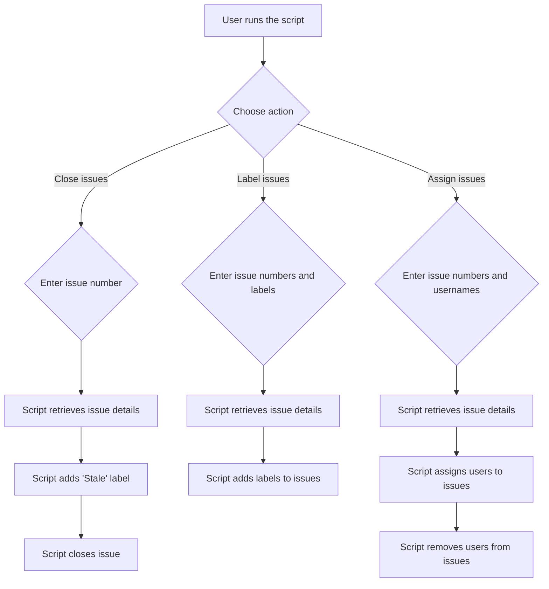

# Git-Interactive Bash Toolkit
The Git-Interactive Bash Toolkit is designed to have various bash scripts interact with git-based website API to allow easier workflow of small, medium and large projects.

## Features
- Closing Multiple or Singular Issue(s)
- Adding Labels to Multiple or Singular Issue(s)
- Assigning or Unassigning users from Issue(s) (experimental)

## Github-Interactive Tool
Coming Soon!

### Installation

#### Technical Flowchart

## Gitlab-Interactive Tool
This tool interacts with the gitlab API. There are two variables you must add in order for the script to function correctly. The tool will be able to label multiple issues, close multiple issues, and assign/unassign multiple issues (experimental)

### Installation
1. Download the repository and vim `gitlab-interactive.sh`
2. Define the variables
 - `GITLAB_PROJECT_ID`: This variable contains the ID of the GitLab project that the script will work with. You can find the project ID in the project's settings under General -> General project settings.

 - `GITLAB_ACCESS_TOKEN`: This variable contains the access token that the script will use to authenticate with the GitLab API. The access token should be generated with the appropriate scopes for the actions that the script will perform.
3. Go to the relative directory of `gitlab-interactive.sh` and use `bash`.

#### Technical Flowchart
